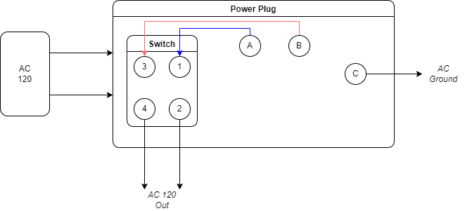
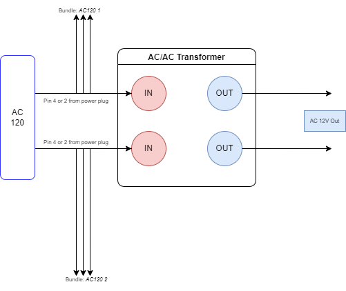
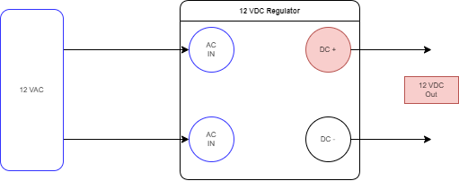
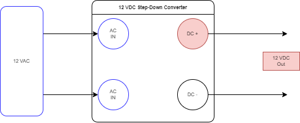
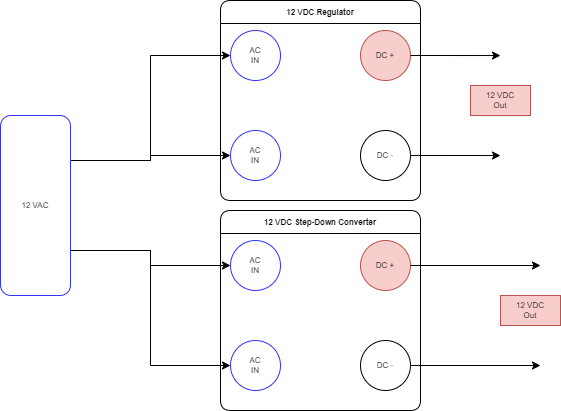
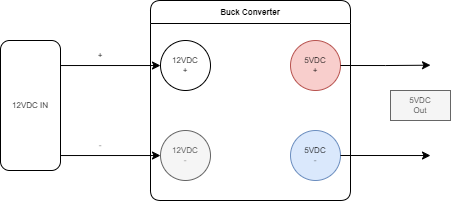
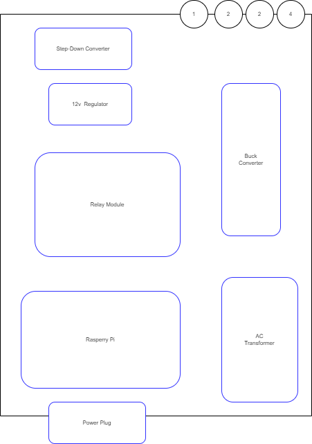
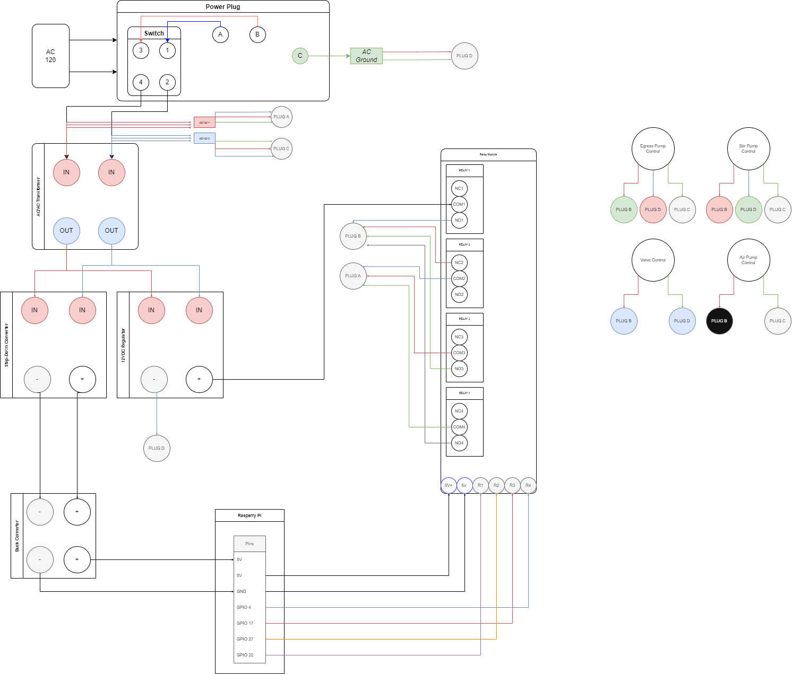
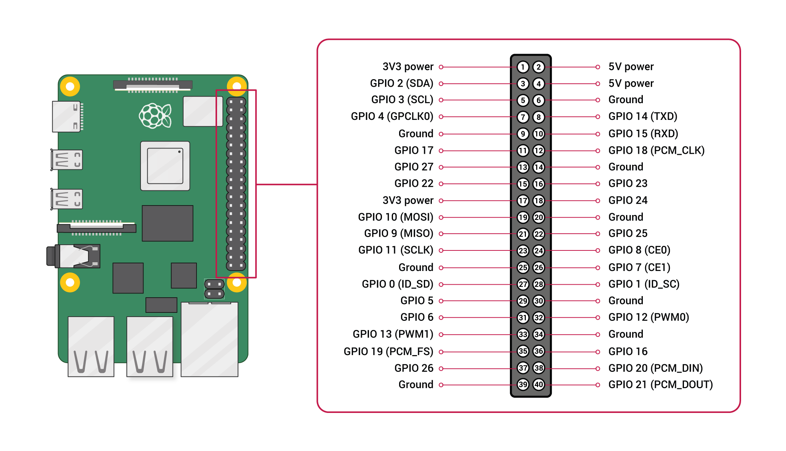

## AutoFeed System: Epsilon

* **Budget:** $450 - 500
* **Capacity:** 10 gallons
* **Base Controller:** Raspberry Pi 4B

---

### About

This system is intended for use in small to medium gardens. Holding 10 gallons, the system can theoretically
provide feeding for 5 days at 2 gallons per day, or 10 days at 1 gallon per day. The recommended 850GPH pump
can dispense ~14 gallons per minute, requiring only a short run period to dispense a desired volume.

The system provides an automated reservoir that dispenses a solution through a 3/4" valve/pex pipe. Users will
need to implement the "final feet" of irrigation from the reservoir outlet to their garden.

**System is compatible with [DIYAutoFeed Controller](https://github.com/StarlightAutomation/autofeed-backend)**

---

## Item List
* 13 Gallon trash can with lid - [Home Depot](https://www.homedepot.com/p/Rubbermaid-13-Gal-White-Spring-Top-Wastebasket-FG5L5806WHT/311917568)
* 3/4" PEX (4 feet) - [Home Depot](https://www.homedepot.com/p/Apollo-3-4-in-x-10-ft-Blue-PEX-Pipe-APPB3410/301541217?MERCH=REC-_-searchViewed-_-NA-_-301541217-_-N&)
* 3/4" Electric Solenoid Valve - [Amazon](https://www.amazon.com/gp/product/B00DQ1J4H0/)
* Vivosun 850GPH Submersible Pump - [Amazon](https://www.amazon.com/gp/product/B086QJPQ6X/)
* 550 GPH Submersible Pump - [Amazon](https://www.amazon.com/gp/product/B07MDBYTLS/)
* Aquarium Air Pump - [Amazon](https://www.amazon.com/gp/product/B01EBXI7PG/)
* 12"x16" ABS Plastic Sheet - [Amazon](https://www.amazon.com/gp/product/B08R9W4NZW/)
* Assorted Screws - [Amazon](https://www.amazon.com/gp/product/B07PHYJ8BB/)

* Raspberry Pi 4B - [Amazon](https://www.amazon.com/Raspberry-Model-2019-Quad-Bluetooth/dp/B07TD42S27/)
* Junction Box (electronics enclosure) - [Amazon](https://www.amazon.com/gp/product/B08281V2RL/)
* Raspberry Pi GPIO Breakout Module - [Amazon](https://www.amazon.com/gp/product/B084C69VSQ/)
* AC 120/AC 12 Transformer - [Amazon](https://www.amazon.com/gp/product/B08T9DJ1LH/)
* 12v Voltage Regulator - [Amazon](https://www.amazon.com/gp/product/B092LPMV76/)
* 5v 4-channel Relay Module - [Amazon](https://www.amazon.com/dp/B08PP8HXVD/)
* AC/DC 12v Step Down Module - [Amazon](https://www.amazon.com/gp/product/B07TJQZZG5/)
* DC-DC Buck Converter (5v/3a) - [Amazon](https://www.amazon.com/gp/product/B07VVXF7YX)
* AC Rocker Switch Plug - [Amazon](https://www.amazon.com/gp/product/B00NWO68JI/)
* Wire Connectors:
  * 4-pin JST - [Amazon](https://www.amazon.com/gp/product/B07VBRRPZ2/)
  * 4-pin Waterproof Connectors - [Amazon](https://www.amazon.com/gp/product/B01LCV8T62/)
  * 1/4" PET Braided Sleeving - [Amazon](https://www.amazon.com/gp/product/B074GM1PK1/)
* Various Wiring:
  * Spool of min. 22 gauge wire (stranded or solid, solid is easier to work with)
  * Spool of min. 16 gauge wire (optional, recommended for all 120VAC connections)

### Component List

#### **Reservoir**
The reservoir is where the nutrient solution is stored, stirred, and pumped out of. It is made up of the
following components:
* 13 Gallon trash can with lid
* 3/4" PEX
* 3/4" Electric Solenoid Valve
* Vivosun 850GPH Pump (egress pump)
* Aquarium Air Pump
* 550 GPH Submersible pump (stir pump)
* 12"x16" ABS plastic sheet
* Assorted Screws
* 4-count of 4-pin waterproof connectors (female)

#### **Control Box**
The control box houses the majority of the electronic pieces required to control the reservoir devices. It is
made up of the following components:
* Junction Box
* Raspberry Pi
* AC/AC Transformer
* 12 VDC Regulator
* 5V 4-channel Relay Module
* AC/DC 12v step down module
* DC-DC buck converter
* AC Rocker Switch Plug
* 4-count of 4-pin waterproof connectors (male)
* 8-count of 4-pin JST connectors (4x male, 4x female)
* Assorted Screws
* Various Wiring

## Software Setup
Before getting into wiring diagrams, you may wish to setup the necessary controller software. This system is
compatible with the DIYAutoFeed Control software. Instructions for downloading and flashing this image to your
Raspberry Pi can be found [here](https://github.com/StarlightAutomation/autofeed-backend).

## Module Wiring Diagrams

This is an overview of individual module wiring since each one has some specifics to it. There is a larger
wiring diagram below that brings each of these components together.

### Power Plug
The AC power plug with rocker switch must be wired up to route power from the AC-in pins through the switch in
order for the switch to be functional. This is technically optional, and you won't need to do this if you don't
want to use the switch. However, this entire tutorial assumes you _are_ using the switch. So, up to you. Kind of.

Pins A and B are interchangeable with switch pins 1 and 3. This configuration will output 120VAC on switch
pins 2 and 4, and AC Ground from pin C.

The control box will need to have 3 available 120VAC circuits (so, 3 additional connections off of switch
pin 4 and 3 additional connections off of switch pin 2 - for a total of 3 additional AC circuits), and will
also need to have 2 AC Grounds available. The process to split these pins simply involves soldering 3 additional
wires to each wire coming off of pins 4 and 2, and 2 additional wires to the wire coming off of pin C.

The bundles will be created in the next step.
* `AC120 1` - The bundle off of pin 4
* `AC120 2` - The bundle off of pin 2
* _leave ground bundle unlabeled_

### AC/AC Transformer
It is easiest to create the AC120 bundles mentioned above when wiring the AC/AC transformer, because the
120VAC will be going directly into the transformer. The 120VAC coming off pins 4/2 on the power plug will be
run to the red `IN` wires, as well as split off to 3 individual connections each for the AC120 bundles.

This will result in the following:
* 2 blue `OUT` wires from the transformer - **these will provide 12 VAC**
* 2 bundles of 3 wires each - **these will provider 120 VAC**

Label these bundles now. Label one of them `AC120 1` and the other `AC120 2`.

Set the blue `OUT` connections from the transformer aside. They will be used in the wiring of the regulator
and step-down converter.

### 12v Regulator and Step-Down Converter

**Note:** In writing this documentation, I've discovered that the _step-down converter is most likely not
required_. The 12VDC regulator _should_ take care of the same job. However, since the step-down converter is
being used in _my_ setup that I am basing this document on, it will be included in the wiring diagrams and
tutorials. You could omit it entirely and instead just use the 12VDC regulator for the same purposes. We won't
go into detail on that though.

#### 12VDC Regulator
The regulator "regulates" the voltage to ensure it doesn't fluctuate off of 12 volts (DC). This regulator is
also an AC/DC transformer, and accepts an AC IN and emits a DC OUT. (Hint: this is why the step-down converter
isn't required).

The blue wires from the AC/AC Transformer (12VAC) will connect to the 12VDC Regulator `AC IN` connections.
12 VDC will be available in the `DC OUT` connections. The pin labeled `GND` on the regulator board is the 
`DC -`, the other is `DC +`.

#### Step-Down Converter
The step-down converter takes in 12VAC and outputs 12VDC. It is ultimately responsible for sending DC power
to the buck converter for the Raspberry Pi power circuit.

The blue wires from the AC/AC Transformer (12VAC) will connect to the step-down converter `AC IN` connections.
12 VDC will be available in the `DC OUT` connections. The converter module includes labeling for `DC+` and `DC-`.

#### Combining these Modules
If you choose to use both the regulator and step-down converter, you can combine the `AC IN` connections pretty
easily.

### Buck Converter
The buck converter steps 12 VDC down to 5 VDC, as well as regulates it to 3A - which is necessary to power
the Raspberry Pi over GPIO pins.

This will output 5VDC +/- which can be used to power the Raspberry Pi on the `5V` and `GND` GPIO pins
respectively.

# Building the Control Box

At this point, you should have the power plug and AC transformer wired up and also have two bundles of 120VAC
wires. If you haven't done this, follow the `Power Plug` and `AC/AC Transformer` wiring above.

If you are using the linked junction box from the parts list, you can follow the layout below. This layout
just shows general placement of components to ensure wiring will all fit/work, but you can change it up in any
way you'd like.

A couple notes about this layout diagram:
* The `Power Plug` module is pictured slicing the border of the junction box. This is because you will need to
cut a hole for the plug so that you can plug in a power cable from the outside, and allow the output connections
to be used on the inside.
* The modules labeled `1`, `2`, `3`, and `4` at the top of the diagram represent the `Device Connectors`. Don't
worry about those quite yet, they'll be applicable towards the end.

Arrange your modules inside the control box and secure them to the included mounting panel (if using the junction box
in the parts list). This will make the rest of the wiring instructions more apparent.

### Full Wiring Diagram
Here is the full wiring diagram for everything inside the control box. Explanations and specifics are below.

What you'll be doing here is creating 4 different connections:
1. `Plug A` - AC 120V - Provides 120 volts to the relay modules
2. `Plug B` - Device Relay Line - connects the device plugs to the relay modules
3. `Plug C` - AC 120V - Provides 120 volts directly to the device connections
4. `Plug D` - Ground + Valve 12v - A combination of AC ground connections and the 12 volt valve connection

The idea here is to wire up each set of modules/components/devices to their respective plugs, then simply
connect all the plugs. Color coding is **very important** here. These plugs are essentially aggregating multiple
different types of connections into a single plug for ease of use. Therefore, color coding must be respected
to ensure that devices are connected to their proper final destination.

Color coding is also used to differentiate components/modules, so it's important to clarify _which_ color
codes are important and which are just aesthetic.

#### Plug A

##### Male End
Using the 4-pin JST connectors, connect the following wires:
1. `blue` - AC120 1
2. `red` - AC120 1
3. `green` - AC120 1

##### Female End
Using a _female JST connector_, connect the following wires:
1. `blue` - Relay 2 COM2
2. `red` - Relay 3 COM3
3. `green` - Relay 4 COM4

Label each of these plugs as `A`.

#### Plug B

##### Male End
Using a 4-pin JST connector _male end_, connect the following wires. These wires will be connected to
**device connections**, which are the 4-pin waterproof connectors.
1. `blue` - Valve Control Connector, RED WIRE
2. `red` - Stir Pump Control Connector, RED WIRE
3. `green` - Egress Pump Control Connector, RED WIRE
4. `black` - Air Pump Control Connector, RED WIRE

As you'll see, Plug B is connecting to the **red wires** of each device connector.

##### Female End
Using a 4-pin JST connector _female end_, connect the following wires:
1. `blue` - Relay 1 NO1
2. `red` - Relay 2 NC2
3. `green` - Relay 3 NO3
4. `black` - Relay 4 NO4

Label each of these plugs as `B`.

#### Plug C

##### Male End
Using a 4-pin JST connector _male end_, connect the following wires. These wires will be connected to
**device connections**, which are the 4-pin waterproof connectors.
1. `blue` - Egress Pump Control Connector, GREEN WIRE
2. `red` - Stir Pump Control Connector, GREEN WIRE
3. `blue` - Air Pump Control Connector, GREEN WIRE

You'll notice that Plug B is connecting to the **green wires** of each device connector,
**except for the valve**.

##### Female End
Using a 4-pin JST connector _female end_, connect the following wires:
1. `blue` - AC120 2
2. `red` - AC120 2
3. `green` - AC120 2

Label each of these plugs as `C`.

#### Plug D

##### Male End
Using a 4-pin JST connector _male end_, connect the following wires:
1. `blue` - LEAVE DISCONNECTED (see below)
2. `red` - AC Ground
3. `green` - AC Ground

Now take the `blue` wire and connect it to the **12 V Regulator** on the negative terminal. Plug D
basically provides AC Ground for the 2 devices that need it, and the DC Negative for the valve.

##### Female End
Using a 4-pin JST connector _female end_, connect the following wires. These wires will be connected to
**device connections**, which are the 4-pin waterproof connectors.
1. `blue` - Valve Control Connector, GREEN WIRE
2. `red` - Egress Pump Connector, BLUE WIRE
3. `green` - Stir Pump Connector, BLUE WIRE

Label each of these plugs as `D`.

### Raspberry Pi / Relay
Now it's time to hook up the Raspberry Pi and the Relay module.

#### Raspberry Pi Power
Power is supplied to the Pi via tha **Buck Converter** DC positive/negative. Connect the DC Positive to
the Raspberry Pi's `5V` GPIO pin (either 5v works). Connect the DC Negative to the Raspberry Pi's `GND`
GPIO pin (any GND works).

#### GPIO Pins
The GPIO pins control the relay modules. **If you are using a Raspberry Pi 4**, you can follow the GPIO pinout
diagram below. Otherwise, you should look up a GPIO pinout specific to your Pi model and use that.

Connect the following GPIO pins:
1. `GPIO 22` - Relay Control 1
2. `GPIO 27` - Relay Control 2
3. `GPIO 17` - Relay Control 3
4. `GPIO 4` - Relay Control 4

#### Relay Power
Finally, connect the power for the relay. This is done by running wires from the Raspberry Pi 5V and GND
pins to the relay's DC+ and DC- terminals respectively.

You may use the same GPIO pins that you connected the power on, or use another 5V/GND set of pins. Any of them
will work. Connect the 5V pin to the relay DC+, and the GND pin to the relay DC-.

## Finishing the Control Box
The control box is now complete. All you need to do now is connect each plug - A, B, C, and D. You can test
the control box by plugging an AC power cable into your power connector and flipping the switch. There should
be lights on 3 components within the control box:

1. Raspberry Pi - should have the red LED and flashing green LED
2. 12v Regulator - should have a solid red LED
3. Buck Converter - should have a solid red LED
