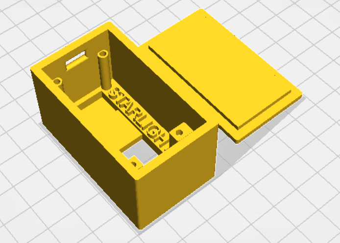
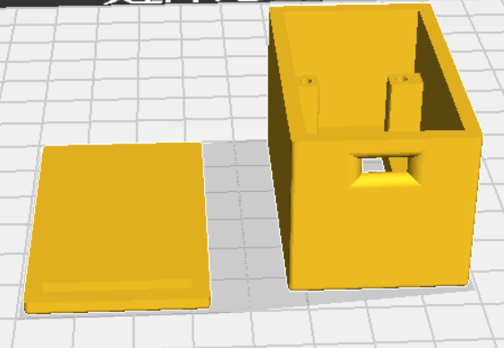
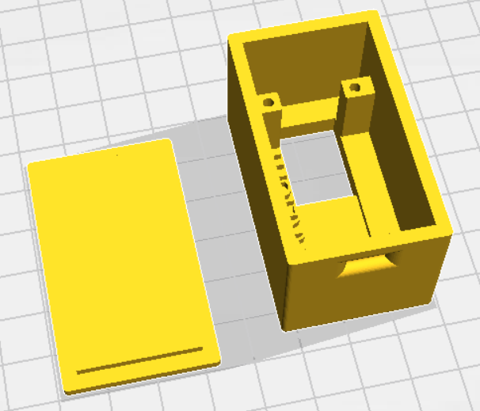

# Delta - Temperature/Humidity Sensor

A simple temperature/humidity multi-sensor built with NodeMCU, DHT22, and ESPHome.

---

### About

The Delta temperature/humidity sensor project is designed to provide a very lightweight, reliable, and replaceable
multi-sensor that integrates seamlessly with Home Assistant.

The result is a combination of NodeMCU/ESP8266, a DHT22 sensor, ESPHome, and a simple enclosure design available in
.STL format.

---

## Materials

* [NodeMCU ESP8266 Development Board](https://www.amazon.com/HiLetgo-Internet-Development-Wireless-Micropython/dp/B081CSJV2V/)
* [DHT22/AM2302 Sensor](https://www.amazon.com/Gowoops-Temperature-Humidity-Measurement-Raspberry/dp/B073F472JL/)
* Access to a 3D printer
* Home Assistant and [ESPHome](https://esphome.io/)

**Total Cost:** ~$11 per sensor (not including initial purchase of 3D printer or PLA)

[STL Download](./delta-dht-v1.stl)






## ESPHome YAML
```yaml
esphome:
  name: Delta-DHT22

esp8266:
  board: nodemcuv2

# Enable logging
logger:

# Enable Home Assistant API
api:

ota:
  password: !secret ota_password

wifi:
  ssid: !secret wifi_ssid
  password: !secret wifi_password

  # Enable fallback hotspot (captive portal) in case wifi connection fails
  ap:
    ssid: "Fallback Hotspot"
    password: !secret wifi_password

captive_portal:

sensor:
  - platform: dht
    model: AM2302
    pin: D2
    temperature:
      name: "Delta DHT - Temperature"
      accuracy_decimals: 2
      unit_of_measurement: "°F"
      device_class: "temperature"
      icon: "mdi:thermometer"
    humidity:
      name: "Delta DHT - Humidity"
      accuracy_decimals: 2
      unit_of_measurement: "%"
      device_class: "humidity"
      icon: "mdi:water-percent"
    update_interval: 15s
```

Alright let's define some things here:

#### `esphome.name`
The `name` field under `esphome` is simply the device name of your sensor. This should be unique to your ESPHome installation,
since this name is used as the hostname for the device.

#### `esp8266.board`
The `board` field under `esp8266` identifies which board you're using. If you use the linked NodeMCU development boards,
you do not need to change this field.

#### `ota.password`
The `password` field under `ota` represents your OTA (over the air) update password for this device. This can be defined
as a string in the yaml or as a string in your ESPHome secrets.

#### `wifi.ssid` and `wifi.password`
These represent the network name and password of your wifi network. These values should be stored in secrets as `wifi_ssid` and
`wifi_password` respectively.

#### `ap.password`
The `password` field under `ap` represents the ad-hoc network password if your device is unable to connect to your defined wifi
network. This is currently set to your wifi network password, but can be changed.

### Sensor

The important bits of the `sensor` definition are as follows:
* `model` - the model of the DHT sensor. If using the linked sensors, leave this as `AM2302`.
* `pin` - which pin the sensor is connected to. Mine is on `D2`.

Everything else should be relatively self-explanatory.

